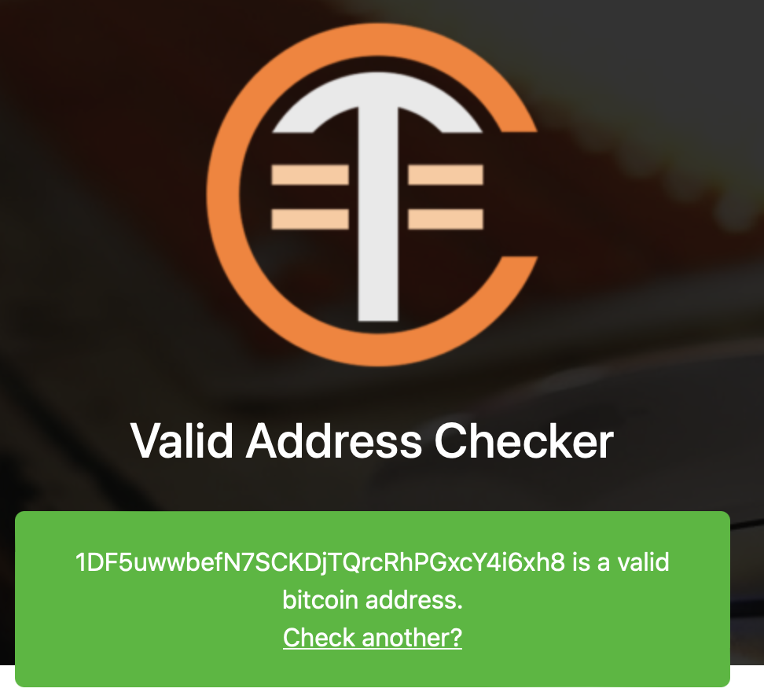

# Generate Address with C++ (Simple Version)


## Define 声明


***本项目仅娱乐作用!任何事情与作者无关!***

***This project is for entertainment purposes only! The author is not responsible for anything!***


## **AboveALL: Install Openssl library**


## Before

1. Download this git repository to your project folder.
```bash
cd [/path/to/your/project]
git clone https://github.com/Derrity/generateAddress.git
```
2. Edit your CMakeLists.txt file to include the library.
```cmake
include_directories(generateAddress/include)
add_subdirectory(generateAddress)
target_link_libraries([your_target_name] bitaddress)
```
3. Include the header file in your source code.
```cpp
#include "GenerateMnemonic.h"
#include "ProcessAddress.h"
```

## Usage
```cpp
std::string mnemonic = GenerateMnemonic(12);
std::string address = Bitcoin::generate_keypair_and_get_address_from_mnemonic(mnemonic.c_str());
```

-----

**As you see:**

the **"12"** is a ***int*** number, you can change it to any else number, but the Standard length is 12.

the **"Bitcoin::"** is a ***class***, and the ***generate_keypai_and_get_address_from_mnemonic()*** is a member function.

now we have `Bitcoin` and `Tron`

in next or future version, the application will have more class like:  **ETH** and so on, so just wait!

the **"address"** is ***string*** type, ~~you can use it to do anything you want~~.


## Last but not Least

the address is available, you can take it on [cointools](https://cointools.org/valid-address-checker)




you can search for it on [BlockChair](https://blockchair.com/) .


----


You can contact me by email:

derrity0731@gmail.com

or

Take the [Github issue](https://github.com/Derrity/generateAddress/issues).

or 

Telegram: [@Derrity](https://t.me/Derrity)
